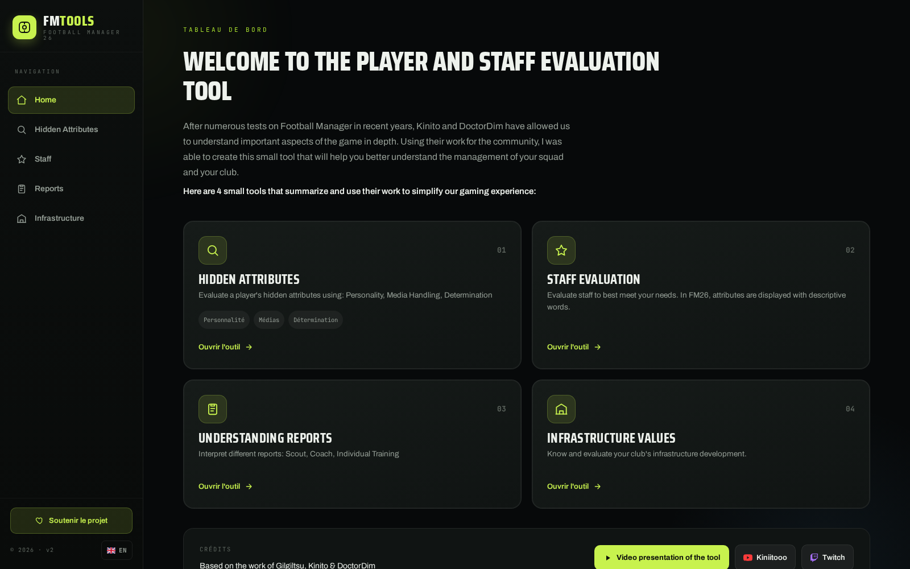
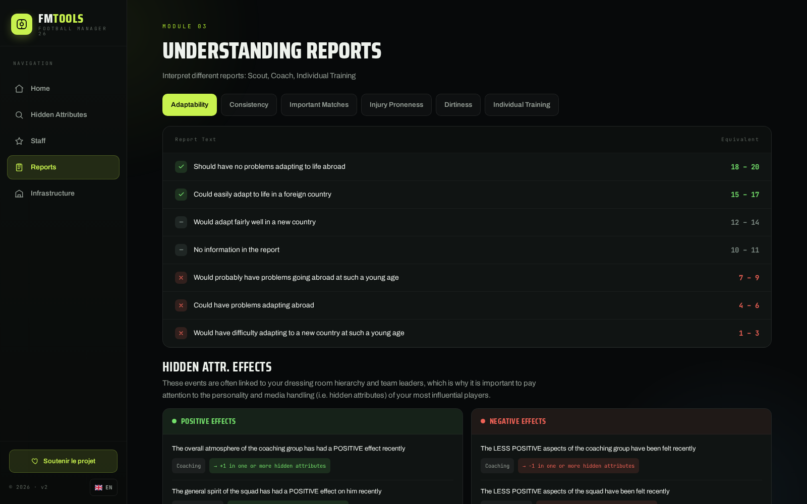

<p align="center">
  
</p>

<h1 align="center">FMToolsV2</h1>

<p align="center">
  <strong>Desktop tools for Football Manager analysis</strong><br>
  Built with Svelte, TypeScript, Tauri, and multilingual support.
</p>

<p align="center">
  <a href="https://github.com/Lib-LOCALE/FMToolsV2/releases/latest">Download</a> ·
  <a href="#screenshots">Screenshots</a> ·
  <a href="#quality-and-release-process">Quality</a>
</p>

<p align="center">
  <a href="README_zh.md"></a>&nbsp;
  <a href="README_ko.md"></a>&nbsp;
  <a href="README_da.md"></a>&nbsp;
  <a href="README_de.md"></a>&nbsp;
  <a href="README_el.md"></a>&nbsp;
  <a href="README.md"></a>&nbsp;
  <a href="README_es.md"></a>&nbsp;
  <a href="README_fr.md"></a>&nbsp;
  <a href="README_it.md"></a>&nbsp;
  <a href="README_nl.md"></a>&nbsp;
  <a href="README_pl.md"></a>&nbsp;
  <a href="README_pt.md"></a>&nbsp;
  <a href="README_sv.md"></a>
</p>

---


## Overview

FMToolsV2 is a cross-platform desktop application that helps Football Manager players evaluate players, staff, reports, and club infrastructure.

The project is also a practical example of a small product-oriented desktop app: localized UI, user documentation, release packaging, and reproducible release verification.

## Features

- Hidden attribute evaluation using personality, media handling, and determination indicators
- Staff evaluation adapted to Football Manager 26 descriptive attributes
- Scout, coach, and individual training report interpretation
- Club infrastructure evaluation
- Multilingual interface and documentation
- Windows and Linux builds distributed through GitHub Releases

## Screenshots

<p align="center">
  
</p>

<p align="center">
  
</p>

## Technology Stack

- Svelte and TypeScript for the user interface
- Tauri and Rust for desktop packaging
- Vite for the build pipeline
- svelte-i18n for localization
- GitHub Actions for release automation

## Quality and Release Process

- TypeScript project structure
- `svelte-check` validation through the `npm run check` script
- GitHub Actions release workflow
- SHA256 checksums for release artifacts
- GitHub attestations for build provenance

Verify a downloaded release with:

```bash
gh attestation verify <downloaded-file> --owner Lib-LOCALE
```

## Installation

1. Download the latest version from [Releases](https://github.com/Lib-LOCALE/FMToolsV2/releases/latest).
2. Run the Windows executable or Linux AppImage.

## Credits

Based on community research and work by Gilgiltsu, Kinito, and DoctorDim.

## Related Projects

- [TomatoTask](https://github.com/Lib-LOCALE/TomatoTask)
- [NewGAN-Manager-26](https://github.com/Lib-LOCALE/NewGAN-Manager-26)
