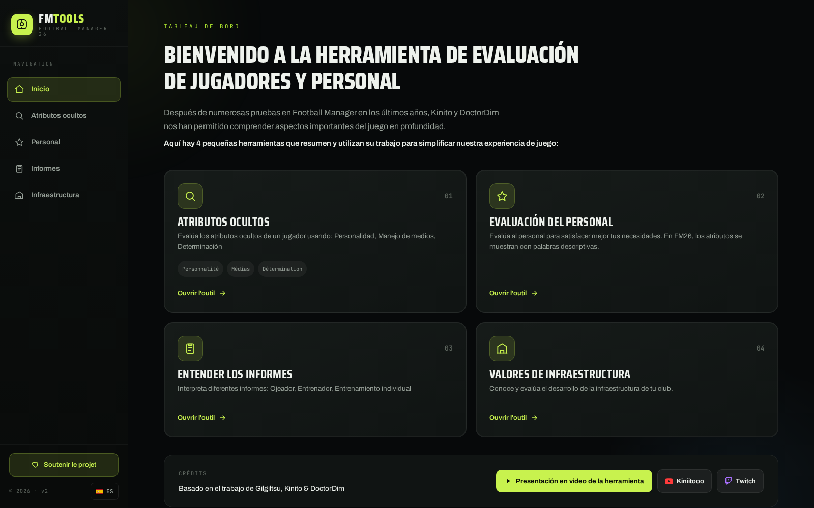
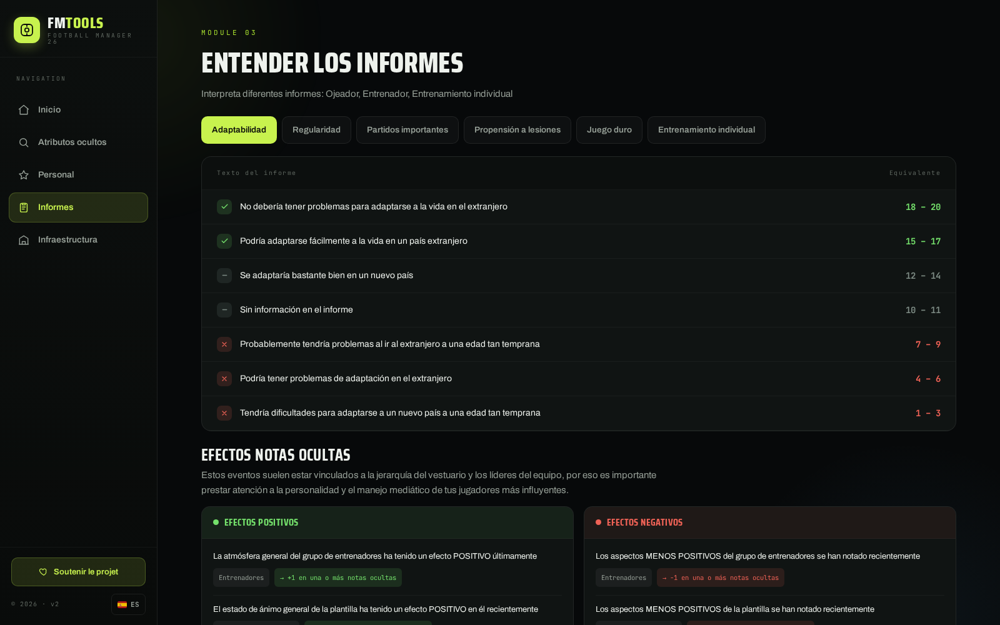

<p align="center">
  
</p>

<h1 align="center">FMToolsV2</h1>

<h4 align="center">📖 Read in your language</h4>

<p align="center">
  <a href="README_bg.md"></a>&nbsp;
  <a href="README_cs.md"></a>&nbsp;
  <a href="README_da.md"></a>&nbsp;
  <a href="README_de.md"></a>&nbsp;
  <a href="README_el.md"></a>&nbsp;
  <a href="README.md"></a>&nbsp;
  <a href="README_es.md"></a>&nbsp;
  <a href="README_et.md"></a>&nbsp;
  <a href="README_fi.md"></a>&nbsp;
  <a href="README_fr.md"></a>&nbsp;
  <a href="README_ga.md"></a>&nbsp;
  <a href="README_hr.md"></a>&nbsp;
  <a href="README_hu.md"></a>&nbsp;
  <a href="README_it.md"></a>&nbsp;
  <a href="README_lt.md"></a>&nbsp;
  <a href="README_lv.md"></a>&nbsp;
  <a href="README_mt.md"></a>&nbsp;
  <a href="README_nl.md"></a>&nbsp;
  <a href="README_pl.md"></a>&nbsp;
  <a href="README_pt.md"></a>&nbsp;
  <a href="README_ro.md"></a>&nbsp;
  <a href="README_sk.md"></a>&nbsp;
  <a href="README_sl.md"></a>&nbsp;
  <a href="README_sv.md"></a>&nbsp;
</p>

---


**Herramientas de evaluación para Football Manager 26**

Bienvenido a la herramienta de evaluación de jugadores y personal

## Description
Después de numerosas pruebas en Football Manager en los últimos años, Kinito y DoctorDim nos han permitido comprender aspectos importantes del juego en profundidad.

## Features
- **Atributos ocultos**: Evalúa los atributos ocultos de un jugador usando: Personalidad, Manejo de medios, Determinación
- **Personal**: Evalúa al personal para satisfacer mejor tus necesidades. En FM26, los atributos se muestran con palabras descriptivas.
- **Informes**: Interpreta diferentes informes: Ojeador, Entrenador, Entrenamiento individual
- **Infraestructura**: Conoce y evalúa el desarrollo de la infraestructura de tu club.


## Capturas de pantalla

<p align="center">
  
</p>

<p align="center">
  
</p>

## Installation
1. Download the latest version from [Releases](https://github.com/Lib-LOCALE/FMToolsV2/releases)
2. Run the executable (Windows) or AppImage (Linux)

## 🔒 Security Verification
All releases are cryptographically signed and verified:
- **SHA256 Checksums**: Compare with `checksums_windows.txt` / `checksums_linux.txt`
- **GitHub Attestations**: Verify build provenance with:
```bash
gh attestation verify <downloaded-file> --owner Lib-LOCALE
```


## Supported Languages (FM26 Official)
 Français |  English |  Deutsch |  Español |  Italiano |  Português |  Nederlands |  Polski |  Ελληνικά |  Svenska |  Dansk |  简体中文 |  한국어

## Check my other projects
- [**NewGAN-Manager-26**](https://github.com/Lib-LOCALE/NewGAN-Manager-26)

## Credits
Based on work by Gilgiltsu, Kinito & DoctorDim

## Support
<a href="https://liberapay.com/TonyBoySUPER/donate"></a>

